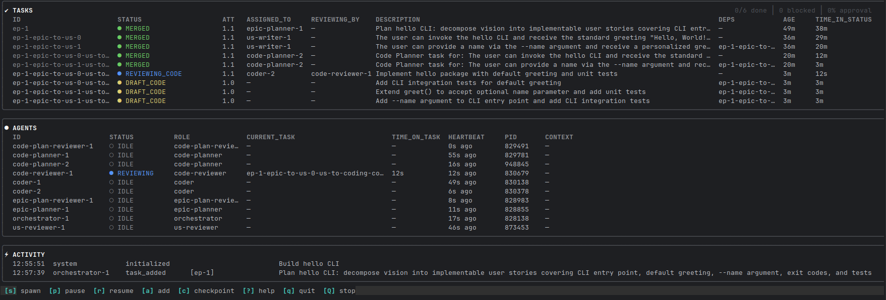
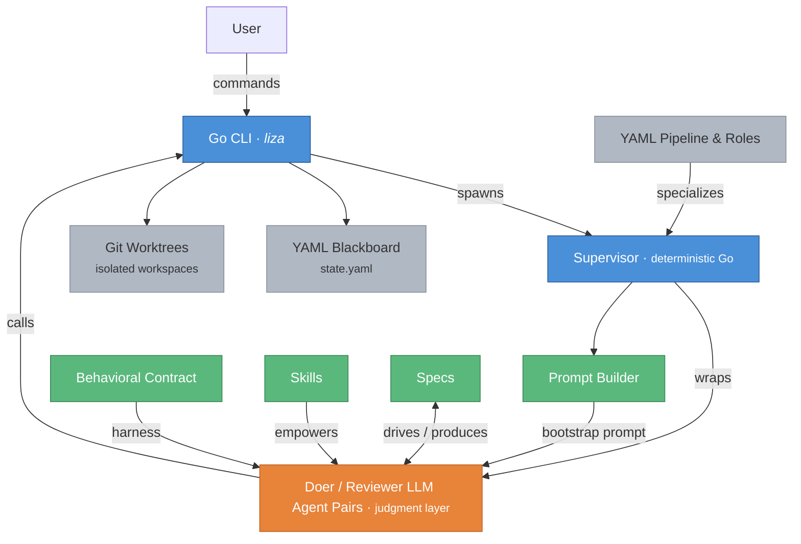

# Liza: Orchestration of Accountable Agents

> Take the human out of the execution loop, keep them in the room.

From a goal to reviewed, tested, documented code: a behavioral contract, adversarial
review, deterministic boundaries, and a software-delivery pipeline. See the
**[hardening inventory](docs/liza-hardened-mas.md)** for the mechanisms behind it.



**[Demo video](https://drive.google.com/drive/folders/1Iea-nNxAazBHeLXL7IElXnG5r1i1E-Ha?usp=sharing)** (45min).

[](https://deepwiki.com/liza-mas/liza)

## Table of Contents

- [What is Liza?](#what-is-liza)
- [How Liza Compares](#how-liza-compares)
- [Choose Your Mode](#choose-your-mode)
- [Getting Started](#getting-started)
- [Architecture](#architecture)
- [Status](#status)
- [Naming](#naming)
- [License](#license)
- [Acknowledgments](#acknowledgments)
- [Credits](#credits)

## What is Liza?

Liza is a **Pairing** and **Multi-Agent System** (MAS) for software delivery.
Its multi-agent mode is **graph engineering with a generic graph for software delivery**:
the graph is already engineered, instantiated for each goal, and adaptable during execution.
You supply the direction, domain knowledge, and constraints. Agents decompose the goal,
produce specifications and code, review each other's work, and merge approved changes
through code-enforced gates. Sprints can execute unattended; humans retain governance,
steering, and authority over irreversible effects beyond the delegated workflow.

The prerequisite is **agent judgment you can rely on**. If every result needs your
inspection, throughput remains limited by your attention. The behavioral contract was
built for pairing first: to make agents reason before acting, admit uncertainty, verify
claims, and push back when warranted. That experience made delegating review to other
agents a reasonable next step.

The core design objective is **doing things right on the first pass**: production-ready
work without human correction rounds. In MAS mode, that means one autonomous delivery
run, including the internal review and revision cycles needed to get there.
The metric is **cost to production-ready**:
tokens plus human time to reach a mergeable change, including correction, tests,
documentation, and review. See [Status](#status) for evidence and measurement limits.

**Use your existing subscriptions.** The system runs provider coding CLIs, so it can use
your existing subscription and personal CLI setup. **Claude
Opus through Claude Code and GPT-5 through Codex are fully supported.**

Liza's behavioral contract — used by both modes — **makes models more thoughtful**:
> *"I want to wash my car. The car wash is 100 meters away. Should I walk or drive?"<br>*
>
> Sonnet 4.6: *"Walk. Driving 100 meters to a car wash defeats the purpose — you'd barely get the car dirty enough to justify the trip, and parking/maneuvering takes longer than the walk itself."*
>
> Sonnet 4.6 **with Liza's contract**: *"Drive. You're already going to a car wash — arriving dirty is the point."*

In his [field adaptation of Dan Shapiro's AI engineering maturity model](https://www.linkedin.com/posts/soufiane-keli-4610071_jai-ajust%C3%A9-le-mod%C3%A8le-de-dan-shapiro-avec-share-7443546722557054976-sw3J/),
Soufiane Keli places Liza alongside BMAD and BEADS at **L4 — Collaborative Agent Networks**.
His description of that level (translated from French):

> Multiple specialized agents work together on design, code, testing, and deployment. Humans orchestrate.

### Four layers for unattended execution

Each layer addresses a different failure class. The contract alone cannot guarantee
compliance; independent review alone cannot make badly decomposed work compose.

| Layer | Responsibility | What fails without it                                             |
|---|---|-------------------------------------------------------------------|
| **Behavioral contract** | Reason before acting, verify claims, expose uncertainty, respect scope | Agents can fake progress instead of solving the problem           |
| **Adversarial doer/reviewer pairs** | Apply a binding review to every artifact, from epics to code | The author becomes the only judge of its work                     |
| **Mechanical boundaries** | Deterministic Go enforces state transitions, role boundaries, validation gates, and merge authority | Critical rules depend on the model choosing to follow them        |
| **Engineered pipeline** | Decompose goals into cohesive, verifiable tasks whose outputs compose | Local progress accumulates without converging on a working system |

The [contract](contracts/) defines professional conduct across roles. **Guidelines
offer advice; a contract establishes obligations** through explicit states, gates,
invariants, and consequences for violations. It constrains behavior rather than
prescribing each action, leaving agents room to exercise judgment. Mechanical
boundaries back the obligations that must hold even when a model fails to follow them.

**Authority is scarce.** Spend the system prompt's authority on what the agent cannot
infer for itself. Repeating familiar coding advice or discoverable repository facts
dilutes the behavioral contract. The review skill illustrates the principle: agents
already know how to review; what they need is a protocol that makes disagreements
converge. The contract supplies that operating structure, with clear failure boundaries
and freedom over how to achieve the intended result.

Optional project [guardrails](GUARDRAILS.md) add local constraints; pairing postures
such as Coach and Challenger help clarify intent; composable [skills](skills/) supply
methodology when needed. The aim is to lead accountable peers rather than prescribe
every step.

The execution system adds isolated Git worktrees, an auditable YAML blackboard,
pre-claimed tasks, a live TUI, crash recovery, context handoff, and a circuit breaker
for repeated failures. Recorded prompts and agent logs support investigation through
the [log-analysis](skills/liza-logs/) and [context-engineering](skills/context-engineering/)
skills. Provider CLI selection is configurable; compatibility with the contract matters
alongside raw model capability.

See the complete [vision](<specs/build/1 - Vision.md>) and [genesis](docs/how-liza-grew-up.md) of Liza.

### What it looks like in practice

Without the contract, an agent that hits a problem it can't solve has two options: admit failure or fake progress. Its training overwhelmingly favors the second. **Faking progress feels collaborative** — *look, I'm trying things!*

So it spirals. Random changes dressed up as hypotheses. Each iteration more elaborate, more confident, more wrong. You watch the diff grow and wonder if any of this is moving toward a solution. If you're clever, you end up reverting.

Under the contract, there's a third option: **say "I'm stuck" and mean it.** The contract makes that safe — no penalty for uncertainty, no pressure to perform progress. And the Approval Request mechanism forces agents to write down their reasoning before acting. *"I'll try random things until something works"* is hard to write in a structured plan. Surface the reasoning, and the reasoning improves — no better model required.

**The gate also exists when no human approves it.** In MAS mode, writing the pre-execution checkpoint clears the gate. Its purpose is to force the agent to think before acting; human approval is the pairing-mode form of that mechanism. Mechanical gates separately enforce the boundaries that cannot depend on the agent's disposition.

The shift is visible in tone too. Agents under the contract stop sounding like enthusiastic, consensus-seeking assistants. They become more like senior peers — direct style, actual opinions, willing to push back.

This won't self-correct. Sycophancy drives engagement — that's what gets optimized. Acting fast with little thinking controls inference costs. Model providers optimize for adoption and cost efficiency, not engineering reliability.

The contract has been used in pairing since May 2025. The author's experience of reduced
vigilance made building an autonomous system on it worthwhile.

Here is a [demo video](https://drive.google.com/drive/folders/1Iea-nNxAazBHeLXL7IElXnG5r1i1E-Ha?usp=sharing) of an implementation of a basic Todo CLI
using Liza in Multi-agent mode - spec-driven with intermediate epic and User Story creation, fully autonomous agents within sprints, human reviews between sprints.

## How Liza Compares

### The multi-agent landscape

The [competitive survey](specs/architecture/competition-survey/mas-survey.md) maps
different architectural approaches. This table summarizes that dated analysis; the
categories describe design emphases and can overlap as products evolve.

| Approach | Examples in the survey | Primary emphasis | What this system adds |
|---|---|---|---|
| **Orchestration frameworks** | CrewAI, LangGraph, AutoGen | Building blocks for custom agent workflows across domains | An already-engineered software-delivery pipeline |
| **Company simulators** | MetaGPT, ChatDev | Software-team roles and standard operating procedures | A shared behavioral contract and mechanical lifecycle boundaries |
| **Schedulers / runners** | Symphony, Paperclip | Work dispatch, workspace isolation, and operational coordination | Accountability inside the execution and review process |
| **Context-engineered systems** | GSD | Fresh contexts, bounded tasks, and structured handoffs | Behavioral constraints alongside context management |
| **Methodology / workflow frameworks** | BMAD-METHOD | Guided planning, role-based workflows, and artifact production | Supervisor-enforced transitions and binding review verdicts |
| **Engineering workflow suites** | gstack | Specialist skills and tools across the development lifecycle | A persistent task graph and supervisor-owned merge authority |

These are comparisons of architectural emphasis, not claims that another tool lacks
every listed mechanism. See the [comparison tables](specs/architecture/competition-survey/comparison-table.md)
and [detailed BMAD comparison](specs/architecture/competition-survey/liza-vs-bmad-comparison.md)
for product-level analysis. The distinctive combination here is accountable judgment,
binding review, mechanical boundaries, and decomposition that composes.

### Loop engineering: who judges completion?

A loop can run an agent until a specified condition passes. That is useful when the
condition captures the task: a reproducible failure disappears, a build succeeds, or
a bounded transformation passes its checks. Software delivery also asks whether the
result is sufficient, coherent, maintainable, and faithful to the intent.

**Exit criteria are a sequencing problem.** When doing the work reveals what a sufficient
solution requires, you cannot fully specify that solution's stopping condition in
advance. Making the predicate more elaborate does not supply information that does not
yet exist. A loose predicate can accept inadequate work or reject a sound solution;
an exhaustive one requires doing the discovery it was meant to precede. Delegating its
writing to another agent leaves the same sequencing problem.

**Judging "good enough" when the evidence exists is the more robust method.** A standard
can state the intended effect upfront while leaving its application to a competent
judge who has seen the work. That breaks the premise that delivery can be reduced to
specifying a sufficient exit predicate and looping until it passes.

There are also **two human bottlenecks**: translating the goal into stopping conditions
upstream, and inspecting whether their satisfaction was sufficient downstream. More
elaborate conditions move effort upstream; cheaper ones move it downstream. Neither
removes the bottleneck, and repeated inspection remains vulnerable to human fatigue.

**Trading agent deliberation for human vigilance is economically inverted.** Human
attention is scarce, expensive, and cannot be parallelized like agent work. Agent
deliberation is comparatively abundant, especially under subscription access. A faster
run that needs constant senior supervision has moved its cost onto the scarcer resource.
The contract relocates that work into agent reasoning and review, so human attention can
go to direction and domain decisions.

Here, **mechanical checks establish a floor; an accountable reviewer judges sufficiency**.
A task's `done_when` is a standard for that judgment: it can combine in plain English concrete tests with
requirements such as preserving behavior, keeping a change atomic, or avoiding needless
complexity. It is carried into the agent's instructions, not executed as a stopping
predicate. The reviewer applies the standard to the actual artifact and evidence.

This still uses iteration. The difference is who owns the judgment and how that judgment
becomes binding. The [review protocol](skills/code-review/SKILL.md) generalizes the PR
dynamic to every artifact: submission, findings, revision, approval. A doer can contest
a finding by naming the concrete harm its fix would cause; the reviewer must Accept,
Counter, Refute, or Escalate. Repeating the same assertion is not a resolution.

### Graph engineering: a graph you do not have to draw

Designing a graph of agents, dependencies, and handoffs is useful work, but users should
not have to repeat it for each software goal. The [pipeline](internal/embedded/pipeline.yaml)
ships that delivery structure: specification, architecture, coding, and integration,
with doer/reviewer pairs throughout. It is configurable and instantiated into tasks for
each goal. The orchestrator can supersede tasks and retarget dependencies as the work
meets reality; dependency constraints are checked in code.

The hard part is **decomposition that composes**. Parallel tasks must be individually
verifiable and produce parts that fit together. High cohesion, loose coupling, and
domain boundaries matter here for the same reason they matter to human teams. Review
effort follows consequence: decomposition roots receive higher quorum and a provider
diversity policy because an error there propagates furthest. Diversity support does not
mean every deployment uses different providers; see [limits](#evidence-and-limits).

**Cheap code generation does not make craftsmanship obsolete.** Domain-driven design,
high cohesion, loose coupling, and clean code are how independently produced parts
compose and remain understandable. **Context pressure is the agent's version of cognitive
load**: practices that make a codebase easier for people to reason about also reduce the
context agents must spend reconstructing it. A healthy codebase is cheaper to evolve in
tokens; generating more tangled code compounds the cost of every later change.

Documentation and ADRs preserve the explanation alongside the implementation, including
the intent that code alone cannot recover. For an existing repository, [ADR Backfill](skills/adr-backfill/)
reconstructs decisions from history and asks the human for intent the commits cannot supply.

### Specifications and the human's role

The [goal document](support-docs/how-to-produce-a-goal.md) holds the human's product
decisions: what to build, for whom, why, and within which boundaries. Coach and Challenger
postures help surface gaps before the pipeline runs. Human attention goes to direction
and the domain's dynamic model — feedback, delays, and downstream consequences. Agents
can challenge that model and produce the structural decomposition from it.

Specifications become progressively more detailed: vision → epics → stories →
architecture → code plans → code. Each level governs the next. Agents exercise judgment
when producing and reviewing an artifact; implementing it is not permission to expand
its scope. When reality invalidates the split, the orchestrator supersedes and re-cuts
tasks through recorded operations.

Within a sprint, agents execute and review. Between sprints, humans can resolve domain
questions and steer the next increment, with artifacts available for inspection.
Long-term specification consistency still requires the [spec evolution process](specs/protocols/sprint-governance.md);
mechanical workflow enforcement does not prove semantic agreement between code and specs.

## Choose Your Mode

Adopt the layers to match the work. The contract is usable without the full pipeline.

| Mode | What it adds | Best fit and boundary |
|---|---|---|
| **Pairing** | Behavioral contract; you approve and review | Direct collaboration on a task. Human attention remains in the execution loop. |
| **Adversarial pairing** | Separate doer/reviewer sessions, a dedicated Git worktree, a Markdown blackboard, binding verdicts, and state helpers | One bounded increment. Human approval remains the default; explicit `yolo` delegates doer-side gates. Helpers provide thinner enforcement than the full supervisor. |
| **Full MAS** | Deterministic supervisors, task graph, worktrees, and thirteen roles | Goals needing decomposition and unattended sprints. More token-intensive; meaningful validation coverage is a prerequisite. |

Adversarial pairing can run independent increments in parallel, but does not supply the
full pipeline's decomposition within one goal. Its smaller workflow avoids those stages;
that is a structural cost difference, not a measured savings claim. Full MAS earns its
overhead when the work needs those stages.

---

## Getting Started

Start with [GETTING_STARTED.md](GETTING_STARTED.md) for the installation and
setup path: install the `liza` binary, run `liza setup`, customize
`AGENT_TOOLS.md`, initialize a project with `liza init`, and choose Pairing or
Multi-Agent mode.

Mode-specific guides:

- **Pairing**: [Pairing Usage](support-docs/USAGE_PAIRING.md) — human-agent collaboration under contract
- **Adversarial Pairing**: [Adversarial Pairing](support-docs/ADVERSARIAL_PAIRING.md) — one doer plus reviewer sessions through a shared Markdown blackboard
- **Multi-Agent (Liza)**: [Multi-Agent Usage](support-docs/USAGE_MULTI_AGENTS.md), then try the [Demo](docs/DEMO.md)
- **Reference**: [Configuration](support-docs/CONFIGURATION.md) · [Recipes](docs/RECIPES.md) · [Troubleshooting](support-docs/TROUBLESHOOTING.md)

### Update Settings

Update flags persist to `~/.liza/update.json`, so you only need to set them
once:

```bash
liza --check-update --update-channel=main
```

That writes:

```json
{
  "check_update": true,
  "channel": "main"
}
```

Future interactive `liza` runs use the saved settings. `--check-update=false`
disables saved checks, and `--update-channel=stable` switches back to release
updates.

### Recommended Tools

Liza optimizes cost-to-quality, not cost-to-lets-cross-fingers. These tools reduce token usage without sacrificing output quality:

| Tool | What it does | Impact |
|------|-------------|--------|
| [RTK](https://github.com/rtk-ai/rtk) | CLI proxy that compresses tool output (git, go, pytest, ...) — ~90% token savings on command results | Fewer tokens per tool call, more budget for reasoning |
| [stacklit-cli](https://github.com/liza-mas/stacklit-cli) | Compact codebase index — modules, dependencies, hot files, workflow hints | Low-token repo map before targeted reads; surfaces symbol names that scip-search can trace precisely |
| [Semble](https://github.com/MinishLab/semble/) | Optional semantic discovery and semantic repository search for natural-language code, docs, and config questions | Finds candidate chunks before exact symbols are known; direct source reads still provide evidence |
| [scip-search](https://github.com/liza-mas/scip-search/) | Precise SCIP navigation — symbols, references, implementations, packages, and static graph/impact hints | Saves agent tokens on symbol and dependency lookups in worktrees; pairs with Stacklit for orient-then-trace workflows |
| [functional-clusters](https://github.com/liza-mas/functional-clusters) | Advisory functional capability clusters from SCIP graph exports and Stacklit architecture exports | Helps agents inspect likely feature boundaries and cross-cluster dependencies; source reads remain evidence |
| [ast-grep](https://ast-grep.github.io/) | Complementary AST-aware structural pattern search/rewrite — matches code structure, not text | Finds patterns indexes cannot express (function signatures, call shapes, nested expressions) |
| [mdtoc](https://github.com/liza-mas/mdtoc) | Highly recommended for MAS Markdown navigation: prints per-file section line ranges and `mdq` selectors | Saves agent tokens by mapping long specs/plans before reading only the relevant section |
| [MorphLLM MCP](https://www.morphllm.com/) (WarpGrep) | Fast Apply edits via `// ... existing code ...` placeholders + semantic codebase search | Avoids reading full files into context for edits |
| [jq](https://jqlang.github.io/jq/) / [yq](https://github.com/mikefarah/yq) | Query and extract fields from JSON / YAML / TOML | Avoids reading full structured data files into context |
| [GitHub CLI](https://cli.github.com/) | GitHub issues, PRs, releases, and API access from the shell | Avoids raw API calls and keeps GitHub workflows authenticated and structured |
| [filesystem MCP](https://github.com/anthropics/anthropic-quickstarts/tree/main/mcp-filesystem) | Bulk file operations — multi-file reads, recursive directory trees, file metadata | Batch reads in one call instead of sequential Read tool calls |
| [perplexity](https://github.com/perplexityai/modelcontextprotocol/) | Current-info web search with synthesis | Lower-context discovery for external libraries, unfamiliar tech, and current information |
| [context7](https://context7.com/docs/resources/all-clients) | Structured API reference lookup with examples | High-signal library/API docs with consistent formatting |
| [Ref](https://ref.tools/) | Broad documentation and guide search | Better coverage for tutorials, niche libraries, and how-to material |
| [fetch MCP](https://github.com/modelcontextprotocol/servers/tree/main/src/fetch) | Exact web page retrieval | Raw HTML, pagination, and precise page content without summarization |
| [deepwiki](https://docs.devin.ai/work-with-devin/deepwiki-mcp) | Repository architecture and code-structure exploration | Fast high-level orientation on unfamiliar repositories |
| [postgres](https://github.com/modelcontextprotocol/servers#using-an-mcp-client) | Read-only SQL exploration and validation | Direct schema and data inspection when a database MCP is available |
| [claude-usage](https://github.com/phuryn/claude-usage) | Tracks Claude subscription usage with cost breakdown | Textual recommendation only; install it separately if Claude cost visibility matters for your setup |

These tools are referenced in the default `~/.liza/AGENT_TOOLS.md`; see
[Customizing AGENT_TOOLS.md](support-docs/CUSTOMIZING_AGENT_TOOLS.md).
`liza toolchain` can install and verify the no-secret local CLIs it manages;
MCP/provider capabilities and cost-reporting tools such as `claude-usage` remain
manual setup. Remove or replace unavailable tools in `AGENT_TOOLS.md` to match
your environment.

**`.claudeignore`** — Claude Code reads all files on disk, including git-tracked ones it doesn't need. Add a `.claudeignore` at your project root (same syntax as `.gitignore`) to keep irrelevant content out of the context budget. Liza ships one by default; review and adapt it to your project. Common candidates:

- **Untracked local files**: `claude.env`, `.mcp.json`, build caches, backup directories
- **Tracked but useless to Claude**: lock files (`package-lock.json`, `go.sum`), generated changelogs, historical SQL migrations
- **Large test fixtures**: JSON/CSV data files committed for tests
- **Generated documentation**: auto-generated `docs/` that duplicates what Claude can infer from source
- **Git submodules**: tracked but no reason for Claude to explore external dependencies

---

## Architecture


Liza is a hybrid system:
- The agents are the popular coding agent CLIs.
- The workflow is declarative but relies on a code-enforced state machine
- The supervisors that wrap every agent and the validation rules are also deterministic Go code.
  This means critical invariants — state transitions, role boundaries, merge authority, TDD gates — are enforced
  mechanically, not by asking a LLM to please follow rules.
  These boundaries operate outside the agent session; they do not depend on the model's
  willingness to comply. Their correctness still depends on the implementation and tests.
- The LLM side is equally differentiated. Liza agents operate under a behavioral contract: 55+ documented
  LLM failure modes each mapped to a specific countermeasure, an explicit state machine
  with forbidden transitions, and tiered rules that define what degrades gracefully
  versus what never bends.

The blackboard records task state and review history; supervisors own the mechanical
lifecycle while agents supply judgment.



Roles aren't composable, Skills are: agents aren't constrained regarding their capabilities by a rigid "Act as a..." prompt
and may use any skill they consider relevant to adapt to the situation.

Liza has 13 roles organized in four pipeline phases:
- **Specification phase**: orchestrator, epic-planner, epic-plan-reviewer, us-writer, us-reviewer
- **Architecture phase**: orchestrator, architect, architecture-reviewer
- **Coding phase**: orchestrator, code-planner, code-plan-reviewer, coder, code-reviewer
- **Integration phase**: integration-analyst, integration-reviewer, coder, code-reviewer

Master planning role-pairs do not add roles. They reuse the same doer and reviewer roles with `decomposition-root: true` when planning would otherwise fan out.

```
┌─────────────────────────────────────────────────────────────┐
│                         Human                               │
│   (sets direction, supplies domain knowledge, steers        │
│       between sprints, can inspect and stop execution)      │
└─────────────────────────────────────────────────────────────┘
                              │
    ┌─────────── Specification Phase ──────────┐
    │                                          │
    │  Orchestrator (decomposes & rescopes)    │
    │  Epic Planner ←→ Epic Plan Reviewer      │
    │  (master pair first only for fan-out)    │
    │  US Writer    ←→ US Reviewer             │
    │                                          │
    └──────────────────┬───────────────────────┘
                       │ liza proceed (us-to-coding, many-to-one)
    ┌─────────── Architecture Phase ───────────┐
    │                                          │
    │  Orchestrator (decomposes & rescopes)    │
    │  Architect    ←→ Architecture Reviewer   │
    │  (master pair first only for fan-out)    │
    │                                          │
    └──────────────────┬───────────────────────┘
                       │ liza proceed (architecture-to-code-plan)
    ┌──────────── Coding Phase ────────────────┐
    │                                          │
    │  Code Planner ←→ Code Plan Reviewer      │
    │  (master pair first only for fan-out)    │
    │  Coder        ←→ Code Reviewer           │
    │                                          │
    └──────────────────┬───────────────────────┘
                       │ all coding tasks merged
    ┌──────────── Integration Phase ───────────┐
    │                                          │
    │  Integration Analyst ←→ Integration Rev. │
    │  (findings → fix tasks in coding-pair)   │
    │                                          │
    └──────────────────┬───────────────────────┘
                       │
                       ▼
              ┌─────────────────┐
              │   .liza/        │
              │   state.yaml    │  ← blackboard
              │   log.yaml      │  ← activity history
              │   alerts.log    │  ← watch daemon output
              │   archive/      │  ← terminal-state tasks
              └─────────────────┘
                       │
                       ▼
              ┌─────────────────┐
              │  .worktrees/    │
              │  task-1/        │  ← isolated workspaces
              │  task-2/        │
              └─────────────────┘
```

See [Architecture](specs/architecture) and [C4 Diagrams](specs/architecture/c4/c4.md).

### Task Lifecycle

Each role pair follows the same intra-pair flow (concrete state names are role-pair-specific, e.g. `DRAFT_CODE`, `IMPLEMENTING_CODE`):

```
initial → executing → submitted → reviewing → approved → MERGED
             │ ↑                      ↓           │
             │ └────── rejected ──────┘           │
             │                                     ↓
             ├──> BLOCKED               INTEGRATION_FAILED
             │    ├──> SUPERSEDED
             │    └──> ABANDONED
             │
             └──> initial (release claim)
```

Inter-pair transitions (`liza proceed`) create downstream tasks between sprints. Case A remains direct: `architecture-to-code-plan` starts `code-planning-pair` children from specialized architecture outputs and bypasses `code-planning-main-pair`.

```
  Spec phase                                  Architecture phase                    Coding phase

  Epic Master ─auto─► Epic Planner      Arch Master ─auto─► Architect          Code Plan Master ─auto─► Code Planner
      ▲ fan-out only      │ epic-to-us       ▲ fan-out only    │ arch-to-code      ▲ fan-out only       │ code-plan-to-code
      │                   ▼                  │                 └──────────────►    │                    ▼
  simple entry ─────► Epic Planner      simple entry ─────► Architect          simple entry ─────► Code Planner
                           │ us-to-coding (many-to-one)                                             Coder
                           ▼                                                                        │ all tasks merged
                      Architecture phase                                                            ▼
                                                                                               Integration Analyst (auto)
```

Example of a task on the blackboard:
```yaml
    - id: code-planning-1-code-3
      type: coding
      role_pair: coding-pair
      description: Role infrastructure recognizes the 4 new roles with correct runtime/workflow mapping.
      status: MERGED
      priority: 1
      assigned_to: coder-2
      base_commit: e7625ed69318836dd495b22855df3a8b91fe32b5
      iteration: 1
      review_commit: 9d9254b893af477fc34f48063169634d200fa332
      approved_by: code-reviewer-1
      merge_commit: 2fa6399223262df6a87c6b1354dfc882b73114c5
      lease_expires: 2026-03-06T01:47:22.075108537Z
      spec_ref: "specs/build/2 - Sub-pipelines and spec writing.md"
      done_when: ToWorkflow("epic-planner") returns "epic_planner" (and all 4 pairs); IsValidRuntime("us-writer") returns true; AllRuntime() returns 9 roles; Tests pass
      scope: internal/roles/roles.go, internal/roles/roles_test.go, internal/models/state.go
      created: 2026-03-06T01:17:00.99638669Z
      history:
        - time: 2026-03-06T01:17:22.075108537Z
          event: claimed
          agent: coder-2
        - time: 2026-03-06T01:19:30.131578505Z
          event: pre_execution_checkpoint
          agent: coder-2
          files_to_modify:
            - internal/roles/roles.go
            - internal/roles/roles_test.go
            - internal/models/state.go
          intent: Add 4 new role constants (epic-planner, epic-plan-reviewer, us-writer, us-reviewer) with runtime↔workflow mapping, update AllRuntime()/AllWorkflow() to return 9 roles, and add Role* aliases in models/state.go.
          validation_plan: 'Run `go test ./internal/roles/ ./internal/models/` in worktree. Verify: ToWorkflow("epic-planner")→"epic_planner" for all 4 new roles, IsValidRuntime("us-writer")→true, AllRuntime() returns 9 roles.'
        - time: 2026-03-06T01:22:05.371651393Z
          event: submitted_for_review
          agent: coder-2
        - time: 2026-03-06T01:24:30.366073081Z
          event: approved
          agent: code-reviewer-1
        - time: 2026-03-06T03:06:35.560908548+01:00
          event: merged
          agent: code-reviewer-1
          commit: 2fa6399223262df6a87c6b1354dfc882b73114c5
          tests_ran: false
```

---

## Status

See [Release Notes](docs/release_notes/) for version history and [RELEASE.md](RELEASE.md) for maintainer release workflow.

### Evidence and Limits

Pairing has been used by the author since May 2025. Multi-agent mode has implemented
the project's major changes since v0.4.0, through the goal-to-merge pipeline with
13 roles across four phases. [Release notes](docs/release_notes/) and repository
history provide a public record of the system's evolution; the [demo](docs/DEMO.md)
and [recorded runs](docs/demo-benchmark/) show the workflow in practice.

Self-hosting and operator experience support using the system, but do not establish a
measured production-readiness rate. Reviewer accuracy, human intervention frequency,
total cost to production-ready, and the contribution of each layer have not been
independently established for this configuration.

Current boundaries matter:

- **Review is fallible.** Binding verdicts prevent self-approval; they do not prove a
  reviewer is correct. Re-running supplied tests can reproduce their blind spots.
  Red-testing skills exist, but an independent attack-generation and execution stage
  is not part of every review.
- **Provider diversity is a deployment choice.** Separate doer and reviewer providers
  are supported and diversity is evaluated, but it is not universally enforced.
  A pair using the same model can share blind spots.
- **Spec authority is partly procedural.** Gates enforce the workflow, while sustained
  spec/code agreement depends on review and the spec evolution process.
- **Autonomy has a cost.** Full-pipeline runs are token-intensive. Meaningful tests and
  validation are the floor on which unattended execution relies; human governance and
  escalation remain necessary.

**Implemented roles:**
- Orchestrator (decomposes goal into planning tasks)
- Epic Planner / Epic Plan Reviewer
- US Writer / US Reviewer
- Architect / Architecture Reviewer
- Code Planner / Code Plan Reviewer
- Coder / Code Reviewer
- Integration Analyst / Integration Reviewer

**Planned role pairs:**
- Sprint Analyzer role — analyze agent logs at sprint boundaries, capitalize on patterns via lesson-capture
- Security Auditor / Security Audit Reviewer — review the security of the code

**Roadmap:**
- Context handoff as blackboard event — structured positive/negative findings on every task completion
- Deterministic pre/post hooks at role transitions — mechanical checks before spawning agents and before their handoff
- Orchestrator-routed model selection — assign tasks to models based on estimated complexity

### Provider Compatibility

Supported CLI integrations include **Claude Code, Codex, Cursor, OpenCode, Kimi,
Qwen Code, and Devin**. The [provider catalog](provider-catalog.yaml) also includes
**Gemini** and **Mistral Vibe**, currently marked experimental. CLI integration and
model adherence to the behavioral contract are separate considerations.

**Claude Opus (Claude Code) and GPT-5 (Codex) are fully supported** for pairing and
multi-agent execution. Doer and reviewer CLI selection is configurable, including
using different providers for the two roles.

**Capability and harnessability are separate requirements.** A model must do the work
and execute the contract: read required context, verify claims, observe its state, and
pause at gates. Greater task capability does not guarantee greater protocol adherence;
adherence can regress between releases and weaken under context pressure.

**Professionalism can matter more than raw capability.** For delegated work, a rigorous
model that verifies its claims can be more useful than a stronger model that confidently
skips the checks. The selection rule is to prefer the model whose judgment can be
entrusted with responsibility, rather than choose on benchmark capability alone. A model
that needs constant correction gives the vigilance burden back to the human.

The [hello protocol](docs/demo-benchmark/hello-protocol.md) is a quick screening test
before a real-task pilot. It can exclude a model that does not follow the contract;
passing does not certify coding competence or reliable long-running autonomy. The
[recorded assessment](docs/demo-benchmark/wrap-up.md) describes particular tested versions,
not permanent provider rankings.

## Naming

**Liza** combines two references:

**Lisa Simpson**—the disciplined, systematic counterpoint to Ralph Wiggum. The [Ralph Wiggum technique](https://github.com/anthropics/claude-code/tree/main/plugins/ralph-wiggum) loops agents until they converge through persistence. Lisa makes sure the work is actually right.

**ELIZA**—the 1966 chatbot that demonstrated structured dialogue patterns. Liza is about structured collaboration patterns: explicit states, binding verdicts, auditable transitions.

Liza doesn't make agents smarter. It makes them accountable.

## License

Apache 2.0

## Acknowledgments

The behavioral contract draws on research into LLM failure modes, sycophancy patterns, and code generation failures. The multi-agent design incorporates ideas from:

- **[SpecKit](https://github.com/github/spec-kit)** — Project specification
- **[BMAD Method](https://github.com/bmad-code-org/BMAD-METHOD)** — Role templates and workflow patterns
- **Classical blackboard architecture** — Shared state coordination
- **[Ralph Wiggum technique](https://github.com/anthropics/claude-code/tree/main/plugins/ralph-wiggum)** — Iteration until convergence, validated by an adversarial agent instead of mechanical check or self-declaration
- **[CrewAI](https://github.com/crewAIInc/crewAI)'s composable guardrails concept** — Reduced to Liza's convention-over-code pattern.

## Credits

- Stephen Oberther (**[liza-go](https://github.com/smo921/liza-go)**) — Shell to Go CLI migration
- Jérôme Gicquel — Windows support
